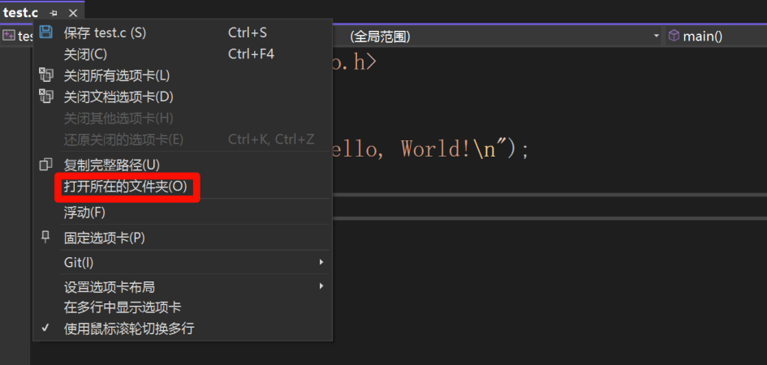
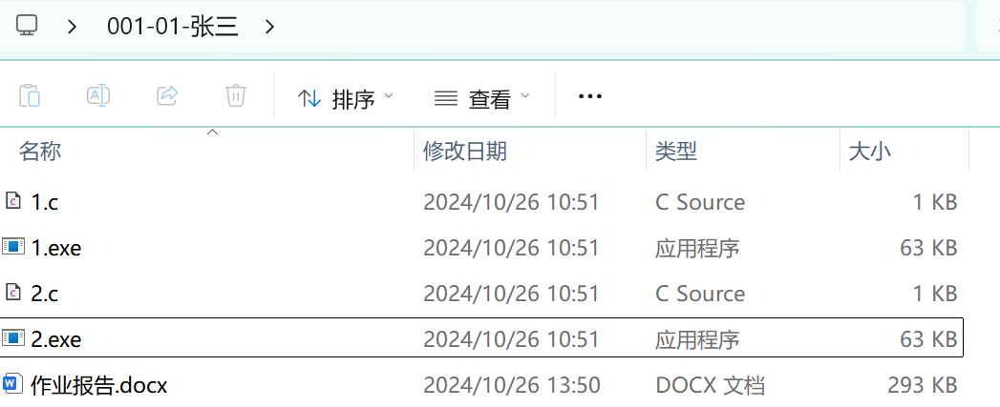

# 作业一（第一期）· 顺序、判断、循环与数组

> **适用对象**：完成导学案0 ~ 导学案5 的同学
> **发布节奏**：作业分两期，本期为第一期；第二期（作业二）在导学案6 ~ 8 之后发布
> **提交方式**：

---

## 一、作业目的

1. 学习编写简单的 C 语言程序；
2. 掌握 C 语言基础，为后来单片机的学习打下基础；
3. 在编写和调试程序的过程中，培养发现问题、分析问题、解决问题的能力。

## 二、作业预备知识

1. C 语言的各种数据类型；
2. 各种运算符、表达式的应用，及表达式类型和优先级问题；
3. 各种数据的输入和输出函数的使用；
4. `if` 及 `if-else`、`if-else if` 构成的分支结构及其使用；
5. `while` 循环、`do-while` 循环、`for` 循环结构及其使用；
6. 一维数组、二维数组与字符数组。

## 三、作业内容

> **无特别说明，所有数字取值均在 `int` 型范围内，字符均为 ASCII 码表中使用的字符。**

| 题号 | 主要知识 | 对应导学案 |
|---|---|---|
| 1 | 循环、取余、进制转换 | 导学案2、4.1 |
| 2 | 字符数组、ASCII | 导学案2、5 |
| 3 | 数组、排序思维 | 导学案5，超纲部分自学 |
| 4 | 二维数组、循环 | 导学案5 |
| 5 | 数组、符号讨论 | 导学案5，超纲部分自学 |
| 6 | 数组、排序 | 导学案5 |
| 7 | 多重循环、去重 | 导学案4、5，超纲部分自学 |
| 8（选做） | 综合 | 全部 |

### 1. 十进制转十六进制

编写程序，实现从键盘上输入一个十进制正整数，输出它转换为十六进制的结果。

示例：

| 输入 | 输出 |
|---|---|
| `170` | `AA` |
| `6666` | `1A0A` |

### 2. 字符串加密

从键盘上输入一个由英文字母组成的字符串，然后按照如下方法加密：对第一个字符，将它的内容在字母表上后移一位，第二个字符后移两位，第三个字符后移三位，以此类推。且规定：变换后字母的大小写不改变，`Z` / `z` 的下一个字符为 `A` / `a`。输出加密后的字符串。

示例：

| 输入 | 输出 |
|---|---|
| `AAA` | `BCD` |
| `Zab` | `Ace` |

### 3. 下一个更大的重排数

编写程序输入一个正整数 `n`，找出符合条件的最小整数：它由重新排列 `n` 中存在的每位数字组成，并且其值大于 `n`。如果不存在这样的正整数，则返回 `-1`。

示例：

| 输入 | 输出 |
|---|---|
| `12` | `21` |
| `21` | `-1` |

### 4. 矩阵旋转

第一行输入两个数据 `m`、`n` 表示矩阵的行和列，接下来 `m` 行每行输入 `n` 个数据，生成矩阵。接下来进入循环，输入数据：输入 `1` 将矩阵顺时针旋转 90 度；输入 `2` 将矩阵逆时针旋转 90 度；输入 `3` 将矩阵旋转 180 度；输入 `-1` 跳出循环，输出处理后的矩阵。（测试数据 `m` 和 `n` 小于 10）

示例：

输入：

```
2 3
1 2 3
4 5 6
1
-1
```

输出：

```
4 1
5 2
6 3
```

### 5. 乘积最大的两个数与三个数

输入一个数组，长度为 10，找出数组中乘积最大的两个数，再找出乘积最大的三个数，输出两个乘积。

示例：

| 输入 | 输出 |
|---|---|
| `-10 -5 1 2 3 4 5 6 9 -1` | `54 450` |

### 6. 奇偶分区排序

输入一个数组，长度为 10，将其中的奇数排在数组前面，偶数排在后面，奇数和偶数中都按照从小到大排列。

示例（示例为 9 个数的演示，以题面长度为准）：

| 输入 | 输出 |
|---|---|
| `5 2 8 1 9 4 7 6 3` | `1 3 5 7 9 2 4 6 8` |

### 7. 和为 0 的三元组

输入一个整数数组记为 `nums`（长度最大为 30），判断是否存在三元组 `[nums[i], nums[j], nums[k]]`，`i`、`j`、`k` 互不相等，同时 `nums[i] + nums[j] + nums[k] == 0`。请你返回所有和为 0 且**不重复**的三元组（`[-1, 1, 0]` 和 `[1, 0, -1]` 认为是重复的）。

示例：

| 输入 | 输出 |
|---|---|
| `1 -1 0 2 3 4 -2 1 2` | `[1,-1,0],[0,2,-2]` |

### 8.（选做）15 根火柴游戏

请编写一个简单的 15 根火柴游戏程序，实现人跟计算机玩这个游戏。游戏规则如下：

- 游戏开始时有编号为 1~15 的 15 根火柴从左往右排成一排。
- 人和计算机每次只能取走 1 到 3 根**位置相邻**的火柴（火柴被取走后在当前位置留下空位，此时左右侧的火柴便不相邻）。谁取走最后一根火柴为胜利者。
- 要求：计算机先手。每次计算机不可以不取；剩下的火柴数为 1 时，必须取走 1 根火柴。人输入火柴编号即可选取火柴，若人违背规则则给予提示并重新选取。
- 每轮回合后显示当前火柴情景，例如若干回合后：

```
II I  I  I  II
```

选做：尽量让计算机赢。

### 9. 作业反馈

你认为本次作业有无优缺点？可从学习内容、作业题目等谈谈你对本次作业的看法。（本题在作业报告内填写）

## 四、作业提交

1. 作业报告内，将 `.exe` 程序运行结果的截屏放入对应表格中。
   - Dev-C++ 生成的 `.exe` 文件与 `.c` 代码在同一目录下且同名，注意寻找。
   - Visual Studio 生成的 `.exe` 文件可按如下方式寻找：右击 `.c` 代码，点击"打开所在文件夹"，进入后点击 `x64`，打开 `Debug` 文件夹即可找到。
   
   
   
   - 其他的编译器可参考以上方式，也可自行上网搜索。
2. 所有题目的 `.c` 程序和 `.exe` 程序，以及作业报告放在同一文件夹下，文件夹的命名方式是：**编号-作业次数-姓名**。例如：`001-01-张三`、`100-02-李四`。文件夹内将代码和程序以题目序号命名，参考下图方式。
   
   
3. 将整个作业文件夹制作为一个压缩包，命名同文件夹，发送到指定的邮箱之中。

> 本期的收件邮箱与截止时间：**发布时填写**。
