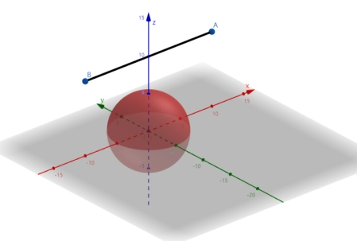

# 作业二（第二期）· 函数、指针、结构体与字符串

> **适用对象**：完成导学案0 ~ 导学案8 的同学
> **发布节奏**：作业分两期，本期为第二期；第一期为作业一
> **提交方式**：

---

## 一、作业目的

1. 学习编写简单的 C 语言程序；
2. 掌握 C 语言基础，为后来单片机的学习打下基础；
3. 在编写和调试程序的过程中，培养发现问题、分析问题、解决问题的能力。

## 二、作业预备知识

1. C 语言的各种数据类型；
2. 各种运算符、表达式的应用，及表达式类型和优先级问题；
3. 各种数据的输入和输出函数的使用；
4. `if` 及 `if-else`、`if-else if` 构成的分支结构及其使用；
5. `while` 循环、`do-while` 循环、`for` 循环结构及其使用；
6. 一维数组、二维数组与字符数组；
7. 函数的定义、声明与调用，参数的传递；
8. 指针的基本用法，指针与数组的关系；
9. 结构体的定义与使用。

## 三、作业内容

> **无特别说明，所有数字取值均在 `int` 型范围内，字符均为 ASCII 码表中使用的字符。**

| 题号 | 主要知识 | 对应导学案 |
|---|---|---|
| 1 | 函数、循环、数学库 | 导学案6 |
| 2 | 函数、嵌套循环 | 导学案6 |
| 3 | 函数、二维数组作参数 | 导学案6、7 |
| 4 | 结构体、随机数、排序 | 导学案6、8 |
| 5 | 结构体、空间几何 | 导学案8，数学部分自学 |
| 6 | 函数、溢出与时间性能 | 导学案6，性能优化自学 |
| 7 | 指针遍历数组 | 导学案7 |
| 8 | 字符数组、条件判断 | 导学案5，字符串处理自学 |
| 9 | 字符数组、统计 | 导学案5，字符串处理自学 |
| 10（选做） | 链表 | 完全超纲，自学 |

### 1. 用级数求 sin(x)

利用公式


（其中 `x` 为弧度）设计函数，用它计算 `sin(x)` 的值，要求精度为 `10^-6`。在主函数中调用，求 `sin 15°` 的值，输出结果。

> 公式文本版：`sin(x) = x - x^3/3! + x^5/5! - x^7/7! + x^9/9! - ...`
> "精度为 `10^-6`"的意思是：当某一项的绝对值小于 `10^-6` 时停止累加。

### 2. 质数判断与选数

编写一个函数，它的功能是对于传入的一个整数，判断它是不是质数。利用这个函数，完成选数问题：对于 4 个正整数，它们可以两两相加，得到 6 个和。判断这 6 个和中有几个质数。

输入 4 个正整数，输出两两相加能得到的质数的个数。

示例：

| 输入 | 输出 |
|---|---|
| `1 2 3 4` | `4` |

### 3. 对称矩阵判断

设计一个函数，判断二维数组是否为对称数组（对称矩阵），如果是则返回 1；不是则返回 0。在主函数中调用此函数，判断一个 4×4 的数组是否为对称数组（对称矩阵）。如果是，输出 `Yes！`，否则输出 `No！`。

### 4. 学生成绩排序（结构体 + 随机数）

定义一个 `Student` 结构体，包含 `int` 类型的学号和 `int` 类型的成绩。

在程序中创建一个包含 5 名学生的数组，使用随机数生成每位学生的成绩和学号。其中学号的取值范围是 100~110，成绩的取值范围是 0~100，均为闭区间。按照成绩从高到低的顺序排序，输出排序后的学生信息。

示例输出：

```
学号 成绩
100  95
101  88
102  76
103  72
104  65
```

> 随机数的用法见导学案6 的"随机数"小节。

### 5. 路径遮挡判断（结构体）

科研人员为了保持北斗数据的完整性，必须确保在保护装置附近没有影响读数准确性的障碍物或干扰源。今天无人机需要进行空中巡逻，需要避开保护装置的影响范围。保护装置可以看作为一个**圆心为 C 点、半径为 R 的实心球**，A 点和 B 点不会在球内。请写一个程序用来判断 A、B 两点路径上是否被遮挡。（说明：AB 和球体的信息要用结构体进行储存。）



**输入说明**：前三行每行三个整数，表示 A、B 和 C 点的坐标。保证坐标点的坐标范围都在区间 (-1000, 1000)。第四行一个整数表示装置的半径 R。

**输出说明**：`遮挡` 或 `未被遮挡`

示例：

输入：

```
10 0 10
-10 0 10
0 0 0
5
```

输出：

```
未被遮挡
```

### 6. 斐波那契前 n 项

编写函数，函数只传入一个参数 `n`，生成斐波那契数列前 `n` 项。（**注意时间性能**：当 `n >= 50` 时朴素的写法可能运行很久，尝试优化。）主函数中为一个循环，可以读取输入数据 `n`，当输入数据为负数时跳出循环，否则输出数列前 `n` 项。（1, 1, 2, 3, 5, 8 …）（测试数据 `n` 小于 150）

示例：输入 `50`，输出：

```
1 1 2 3 5 8 13 21 34 55 89 144 233 377 610 987 1597 2584 4181 6765 10946 17711 28657 46368 75025 121393 196418 317811 514229 832040 1346269 2178309 3524578 5702887 9227465 14930352 24157817 39088169 63245986 102334155 165580141 267914296 433494437 701408733 1134903170 1836311903 2971215073 4807526976 7778742049 12586269025
```

### 7. 指针遍历数组

创建一个一维数组和一个二维数组：一维数组元素为 1 到 9；二维数组为 3×3 矩阵，元素从 1 到 9 按行填充。**使用指针遍历数组。**（体会一下指针的作用，理解数组中的 `[]` 和指针的关系）

示例输出：

```
1 2 3 4 5 6 7 8 9
```

### 8. 密码校验

输入两个字符串，表示密码和确认密码。密码只允许存在数字、大小写字母、`_`、`@`、`?`；密码的长度必须大于 8 小于 20；两次密码必须一样（注意大写字母和小写字母认为是一样的）；密码至少含有：一个数字、一个字母、一个特殊字符。如果符合要求且两个字符串相等输出 `True`，否则输出 `False`。

示例：

输入：

```
1234abc@a
1234abc@A
```

输出：

```
True
```

### 9. 回文与字母统计

输入一个字符串，去除字符串中所有空格和标点，统计字母出现的次数（同样不考虑大小写），并判断是否回文。如果在判断回文串时对称位置存在大小写字母则认为是一样的，且将其统一改为小写，否则保留原本的大小写。输出处理后的字符串，输出字母出现次数，输出是否回文。

示例 1：输入 `A man, a plan, a canal: Panama`

```
处理后的字符串: amanaplanacanalpanama
a: 10, c: 1, l: 1, m: 2, n: 4, p: 1
是回文字符串
```

示例 2：输入 `A Man, a Plan, a canal: Panawa`

```
处理后的字符串: aManaplanacanalpanawa
a: 10, c: 1, l: 1, m: 2, n: 4, p: 1, w: 1
不是回文字符串
```

### 10.（选做）学生管理系统（链表）

实现学生管理系统：定义学生结构体，包含学号（唯一）、姓名、成绩（0-100）和**指向下一个节点的指针**，实现新节点的创建、插入、删除、查找和遍历功能。

> 链表是导学未覆盖的内容，本题完全靠自学，作为选做挑战。

### 11. 作业反馈

你认为本次作业有无优缺点？可从学习内容、作业题目等谈谈你对本次作业的看法。（本题在作业报告内填写）

## 四、作业提交

1. 作业报告内，将 `.exe` 程序运行结果的截屏放入对应表格中。
   - Dev-C++ 生成的 `.exe` 文件与 `.c` 代码在同一目录下且同名，注意寻找。
   - Visual Studio 生成的 `.exe` 文件可按如下方式寻找：右击 `.c` 代码，点击"打开所在文件夹"，进入后点击 `x64`，打开 `Debug` 文件夹即可找到。
   
   
   
   - 其他的编译器可参考以上方式，也可自行上网搜索。
2. 所有题目的 `.c` 程序和 `.exe` 程序，以及作业报告放在同一文件夹下，文件夹的命名方式是：**编号-作业次数-姓名**。例如：`001-01-张三`、`100-02-李四`。文件夹内将代码和程序以题目序号命名，参考下图方式。
   
   
3. 将整个作业文件夹制作为一个压缩包，命名同文件夹，发送到指定的邮箱之中。

> 本期的收件邮箱与截止时间：**发布时填写**。
