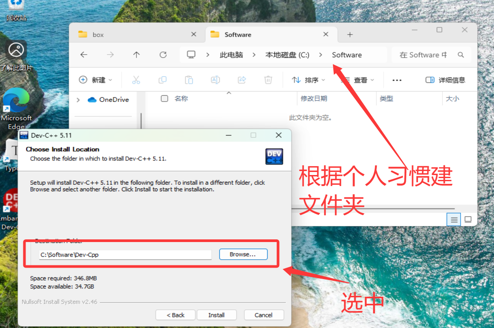
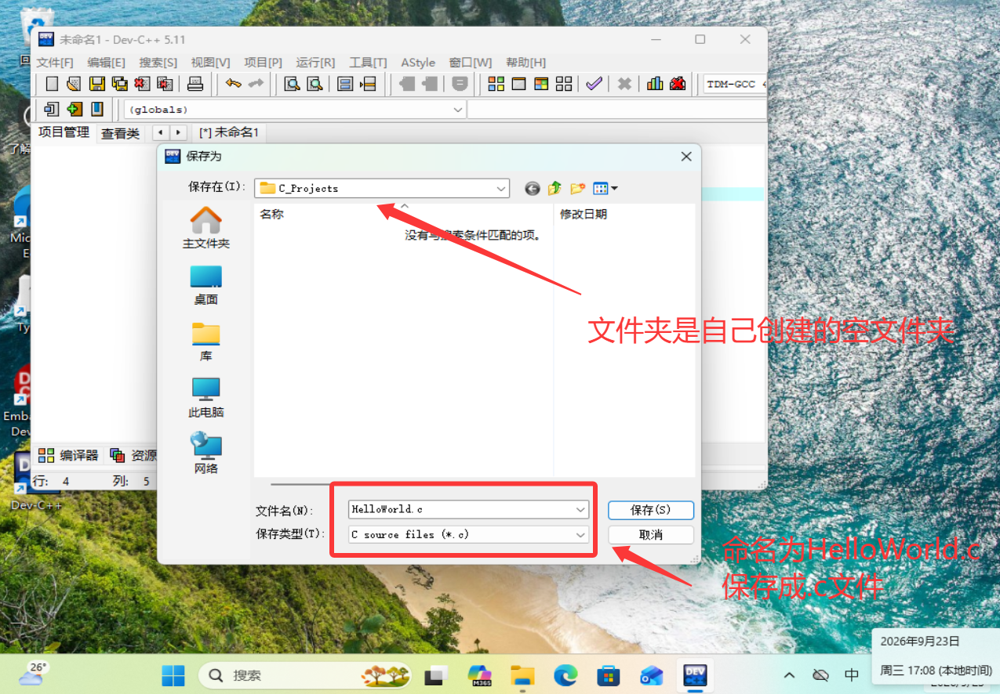
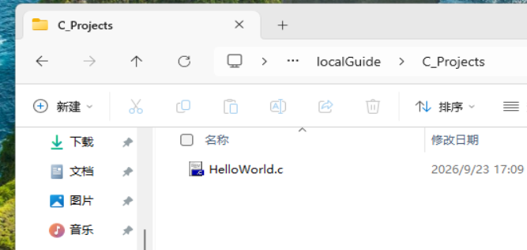
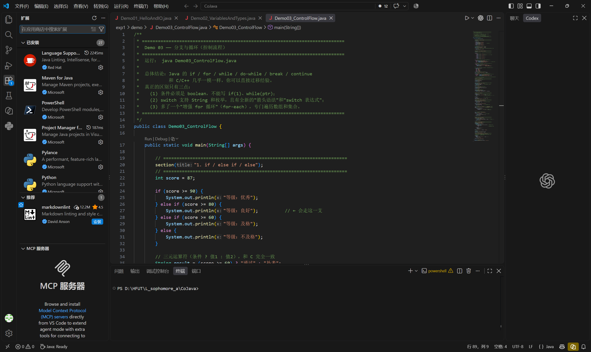
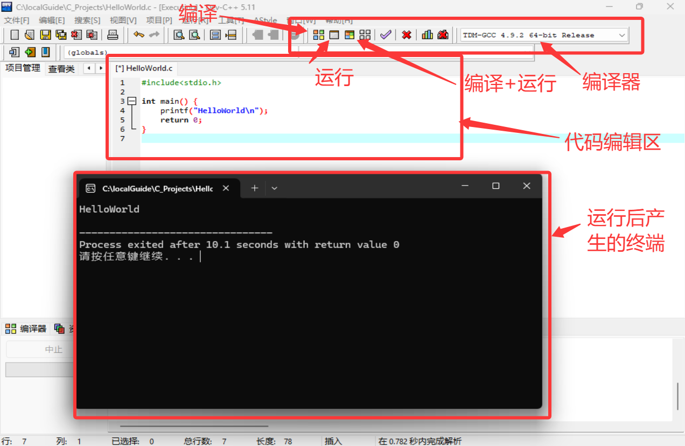
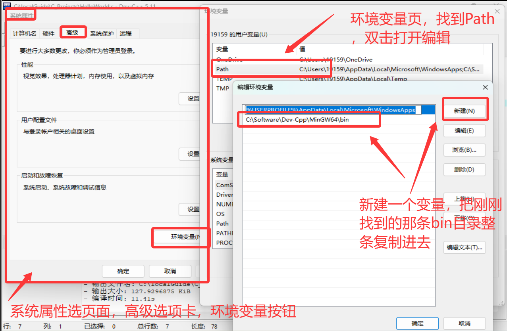

# 导学案1 · 认识 C 语言与开发环境

> **适用对象**：零计算机基础，不限专业
> **参考课程**：浙江大学 翁恺《C 语言程序设计》第 1 章
> **预计用时**：1 小时（含动手操作）
> **本节目标**：跑通第一个程序，理解"编辑 / 编译 / 运行"
> **食用方法**：读文档、理解、跟着行动，不要轻易采用复制代码的方式，导学案1 的一切内容按需自取

---

## 1.0 序

**If you give someone a program, you will frustrate them for a day; if you teach them how to program, you will frustrate them for a lifetime.**

## 1.1 认识 C 语言

### 编程语言是什么

计算机的 CPU 只认得电信号的高低，也就是 `0` 和 `1`。让人直接写 0 和 1 是不现实的，于是有了一层层的翻译：

```
更高级的语言  Python / Java        ← 最好写，离人最近
      ↑
高级语言      C 语言               ← 我们在这里
      ↑
汇编语言      mov / add            ← 和硬件一一对应
      ↑
机器语言      01001000 11110000    ← CPU 能够执行
```

越往上越好写、越好移植；越往下越贴近硬件、越高效。 C 语言则是"离硬件最近的高级语言"之一——代码短、运行快、能直接操作内存，同时又有清晰规范的语法结构。

那么 C 语言和 STM32 是什么关系？STM32 里跑的程序（固件）几乎全部是用 C 语言写的，所以学 C 就是学"怎么给 STM32 下命令"。所以在实验室，学 C 不是"多学一门语言"，而是**入场的门票**。

我们现在不要求你成为 C 语言高手，目标是三条：**能读懂代码、能写出结构清晰的程序、能看懂报错**。剩下的，等你把程序烧进板子、看到灯真的亮起来的时候，自然会需要。

---

## 1.2 开发环境

### 在我们的电脑上怎么开始写代码？

本质上，代码可以写在任何地方，因为它只不过是一串文本，你可以打开一个真正的IDE写代码，你也可以打开电脑记事本写代码，你甚至可以在一张白纸上写代码。代码不过是一串文本，你写它的过程叫做**编辑**，这串文本要通过**编译**被转化为可被计算机执行的**程序**。

当然我们在纸上学代码多少有点不像话，所以我们还是希望电脑上有些工具可以帮助我们做**编辑、编译、调试执行结果等**其他相关开发活动，**集成开发环境(Integrated Development Environment, IDE)** 就是一个集成了这些功能的软件，你可以在它上面写代码，管理文件、快速编译、运行等等，好的 IDE 还支持代码补全、插件等。

接下来我介绍两个可能用得到的 IDE ：

| 对比项 | Dev-C++ | Visual Studio 2026 |
|---|---|---|
| 体积 | 约 50 MB，几十秒装完 | 数 GB（勾选 C++ 桌面开发后约 6~10 GB） |
| 上手难度 | 极低，装完就能写 | 中等，有"解决方案 / 项目 / 工作负载"等概念 |
| 界面 | 老旧，像 Windows 7 时代 | 现代、专业 |
| 代码补全 | 弱 | 强 |
| 调试能力 | 基础可用 | 业界一流（断点、变量监视、调用栈） |
| 使用的编译器 | 自带 MinGW（gcc） | MSVC（微软自家编译器） |
| 适合场景 | **我们的简单教程、小练习** | 计算机专业同学，或者你想要良好的代码体验（Dev的高亮、补全等确实有点老旧） |

> **本导学案的建议：先用 Dev-C++ 把 Hello World 跑起来。**
> 理由是：你现阶段最大的敌人是"语法和概念"，不是"配置环境"，我们也不是精修C语言，任何一个环境都足以支撑我们的学习了。那么如果你想要更舒服的工作环境，可以自己再花时间琢磨。

### Dev-C++

1. 在我们的导学压缩包中，找到安装包 `Dev-Cpp_5.11_TDM-GCC_4.9.2_Setup.exe` 右键选中以管理员身份运行，跟着安装向导基本保持默认即可，唯一要调整的是**语言**和**安装路径**。这里说明 `GCC4.9.2` 已经是上古版本了，如果你需要进阶学习，可以继续钻研，但是已经足够支持我们的学习任务了。

2. 安装向导第一个页面是语言，语言似乎只有英文，如果没有中文就不要动了。

3. 后面同意许可证，再是 `Choose Components` 页面，保持默认即可，点 Next 进入配置安装路径。

4. 不建议安装在D盘，**安装路径不要包含中文和空格**，建议在 D 盘自己增加一个类似 `Software` 的文件夹，这样以后再有软件装进来位置就放这里，那么安装的位置就类似 `D:\Software\Dev-Cpp`  （我的虚拟机中只有C盘，你自己建到D盘即可，安装时Software文件夹下会自动创建 `Dev-Cpp` 文件夹作为软件的根目录名）。建好文件夹，点击右边 `Browse...` 找到对应文件夹即可。

5. 安装完成后，首次启动，这里又可以选择语言，自主选择中文或者英文，其余选项保持默认即可。

6. 对于新手，我们就不创建项目了，直接单文件执行，但是仍然需要一个文件夹当做工作区：

   > 左上角 `文件->新建->源代码` ，写入任意文本后 `Ctrl + s` 保存，在弹出的提示框中，给文件命名，保存类型为C源文件，选择一个合适的文件夹，如我这里创建了一个名为 `C_Projects` 的文件夹
   >
   > 
   >
   
   
   
   > 可以看到空文件夹下多了一个C文件，那么不想折腾的可以跳过 VS 2026，进入1.3节，我们开始运行程序。
   >
   > 

### Visual Studio 2026

1. 自行找b站教程，下载 **Visual Studio 2026 Community（社区版）**，个人与学生免费（我们的附件 `Others.zip` 中也有相关安装包，但是是本人去年年底留下的，不确定是否可用，且可能还会要求更新）。
2. 安装器里**必须勾选"使用 C++ 的桌面开发"**这个工作负载，否则装完不能写 C。

3. 打开 VS → **创建新项目** → 搜索"**空项目**"（Empty Project，C++）→ 项目名填 `HelloC` → 位置同样**避免中文路径**。

4. 在右侧"**解决方案资源管理器**"中：右键"源文件" → **添加 → 新建项** → 选"C++ 文件(.cpp)"，但**把文件名改成 `hello.c`**。
   
   > 后缀是 `.c` 才是 C 语言模式，这一步很关键。

5. 敲入代码 → 点上方绿色 ▶（本地 Windows 调试器），或按 `Ctrl + F5` 直接运行不调试。

> **VS 用户必看的小坑**：VS 默认会把 `scanf` 等多个C语言函数判为"不安全"并报 **C4996** 错误，导致编译失败。解决方法也很简单，加上编译宏即可，这些概念如果你很熟练，可以现在解决，但如果你是个完全纯粹的 green hand，那么也可以等到遇到问题的时候再处理（或者问问AI）。
> 解决办法：右键项目 → **属性** → **C/C++ → 预处理器** → 在"预处理器定义"里加一行 `_CRT_SECURE_NO_WARNINGS` → 确定。

### 拓展简介：VSCode

**VSCode（Visual Studio Code）严格来说不是 IDE，它是一个"高级文本编辑器"。** 它本身**不含 C 编译器**，要用它写 C，你得自己：

1. 安装 **C/C++ 扩展**（Microsoft 出品）；
3. 单独安装编译器，并把它加入系统环境变量 `PATH`；
4. 配置 `tasks.json`（怎么编译）和 `launch.json`（怎么调试）。

- 轻、好看、有良好的插件生态、和 Git 与各种 AI 工具结合得很好，很多人工作之后天天用它。



---

## 1.3 "Hello World" 与编译

### 运行

好的现在我们回到代码页`HelloWorld.c` 输入以下代码后点 编译 + 运行：

```c
#include <stdio.h>

int main(void)
{
	printf("Hello World\n");
	return 0;
}
```

运行后屏幕上出现：

```
Hello World
```

恭喜，你已经完成了一个 C 程序的完整生命周期：**编辑 → 编译 → 运行**。

> 下图页面展示了你工作区入门常用到的三个区域
>
> 最上面的是调式工具，包括编译、运行、编译+运行、还有编译器版本号
>
> 中间的页面是你的代码编辑区，下面是编译运行后的终端



### 逐行拆解

| **代码**             | **含义**                                                     |
| -------------------- | ------------------------------------------------------------ |
| `#include <stdio.h>` | 告诉操作系统，我要去使用的工具来自哪里，前期我们只有stdio.h这一个工具箱，暂时不需要考虑那么多。 |
| `int main()`         | **程序的大门**。操作系统运行时，第一件事就是找到 `main` 并从它开始执行。它下面的花括号里就是你写的代码，程序将按照一定逻辑逐行运行。 |
| printf()             | 用于输出一些结果，如本例中输出了字符串"HelloWorld"。         |
| return 0             | 返回程序状态码，如果一个程序顺利执行完，那么它会告诉执行它的操作系统，一切正常结束，这个“正常”的编码就是0。如果程序在运行中出现了某些错误，那么它可能就会是一些其他的错误码。 |
| `;`                  | 用于表示每个句子结束                                         |

### 三条铁律

1. **所有标点必须是英文标点**：`,` `;` `"` `(` `)` `{` `}`。
   中文分号 `；`、中文引号 `“”` 是最经典的错误，而且肉眼很难看出来——如果你从微信/QQ 里复制代码，尤其要小心。
2. **C 语言区分大小写**：`printf` 对，`Printf`、`PRINTF`、`PrintF` 全错。
3. **代码要缩进**：花括号里的内容统一按 `Tab` 键缩进一层，本实验室的代码风格就是制表符（和飞控代码一致）。Dev-C++ 里按 `Tab` 得到的就是制表符；VS Code 默认插 4 个空格，想跟实验室统一就点右下角的 "Spaces: 4" 切成 Tab。编译器完全不在乎缩进，但**你在乎**，因为当你写得乱起八遭的时候，代码长了就会看不懂。

### 简单理解编译

1.2节开头我们已经讲解了编译，现在我们简单实践一下。

打开你代码所在的那个文件夹，里面有一个后缀为 `.c` 的**代码文件**，这就是你正在编辑的，还有一个后缀为 `.exe` 的**可执行程序**，这个是在你点击编译的时候生成的。当程序运行时，就是执行了这个.exe文件。你可以把它删掉，再去点击编译观察验证。

---

## 1.4 命令行（选读）

> 这一节标了"选读"，因为我们的工具软件足够完善了，如果你不在意哪些工具干了什么，也可完成任务，大可以后有兴趣了再了解。

### 什么是命令行

平时我们用鼠标点图标，这叫**图形界面（GUI）**。
**命令行（CLI）是用打字的方式给系统下命令**，比如"进入这个文件夹""列出里面的文件""运行这个程序"。

Windows 上打开命令行的两种方式：

- 按 `Win + R`，输入 `cmd`，回车（打开"命令提示符"）；
- **或者**在任意文件夹的**地址栏**里输入 `cmd` 再回车 —— 这样打开的命令行**已经在你那个文件夹里了**，非常方便。**推荐这种。**

> 常见命令见 `附录一_Windows CMD常用指令`.
>
> 这里直接给出：
>
> | 指令          | 作用           |
> | ------------- | -------------- |
> | `d:`          | 切换到 D 盘，注意windows不能用cd直接切换盘符    |
> | `cd <路径值>` | 跳转到某个路径，注意 `.` 表示当前位置，`..` 表示上一级目录 |
> | `dir`         | 查看当前文件夹，显示当前目录下有的所有子文件夹和文件等 |


`gcc` 就是一个C语言的编译器，输入 `gcc HelloWorld.c` 表示用`gcc` 这个工具去编译 `HelloWorld.c`这份代码。那么我们来试一下，在 `cmd` 终端用上述几个简单指令找到 `HelloWorld.c` 所在的文件夹，依次输入如下指令


- `gcc HelloWorld.c -o helloWorld.exe`：让 gcc 编译 `HelloWorld.c`，`-o` 指定输出的可执行文件名（如果不写这个 `-o` 同样可以执行编译，但是编译出来的程序会被默认命名）。
- `hello.exe`：运行它。

常用参数：

| 参数 | 作用 |
|---|---|
| `-Wall` | 显示所有警告 |
| `-g` | 生成调试信息，之后才能打断点 |
| `-std=c99` | 使用 C99 标准 |
| `-o 名字` | 指定输出的可执行文件名 |

**推荐写法**：`gcc -Wall -g HelloWorld.c -o HelloWorld.exe`

### PATH

在终端你输入一个指令时，计算机会先检查它是不是系统命令或是不是当前目录下的某个可以操作的文件或程序，比如说你输入 `cd` 这是系统命令，你输入 `HelloWorld.exe`，这是当前目录的可执行程序（一定是当前目录下的才能找到，换一个目录，计算机就不知道它是什么了）。

那么如果一个指令既不是系统的指令，也不是当前目录下的程序，而计算机又想使用它，该怎么办呢？如果你正常安装IDE，那么 `gcc` 应该已经能正常使用了，但如果没有，比如输入 `gcc` 指令时，系统回复：

```bash
'gcc' 不是内部或外部命令，也不是可运行的程序或批处理文件。
```

说明系统不知道 `gcc.exe` 在哪，现在 `gcc` 这个编译器就在你的电脑上，但是找不到。这时，系统会到一张名为 `PATH` 的表中去寻找，`PATH` 中写到了哪些目录，它就会去检查这些目录，看下面有没有我要的这个工具。

**把 gcc 所在文件夹加进 PATH**

在你刚刚安装Dev-C++的那个安装目录，下面应该会有 `MinGW` 这个文件夹，文件夹下面应该还有一个 `bin`子目录，下面找一找，你就会发现，`gcc` 就在这里，现在我们要把这个路径位置添加入 `PATH` 。

`Win + R` 并输入 `sysdm.cpl` 打开系统属性，找到高级选项卡，下方点击环境变量，找到Path，并把刚刚找到的bin的路径整条复制进去，**完成后注意点确认，不确认是不会生效的**。



**重开一个 cmd 窗口（已经开着的窗口不生效）**，在任意路径敲 `gcc --version`，如果能打印出版本号就对了

### 一个完整 demo（可以自己试试）

`calc.c`：

```c
#include <stdio.h>

int main(void)
{
	printf("1 + 1 = %d\n", 1 + 1);
	return 0;
}
```

命令行：

```bat
gcc -Wall calc.c -o calc.exe
calc.exe
```

输出：

```
1 + 1 = 2
```

（`%d` 的意思是"这里要填一个整数"，**下一节详细讲**。）

---

## 1.5 本节小结与自查

**学完本节，你应该能做到：**

- [ ] 用一句话说清：编程语言是什么、C 语言的定位、C 与 STM32 的关系
- [ ] 安装 Dev-C++，并编译运行一个程序
- [ ] 理解什么是IDE，解释"编辑 / 编译 / 运行"的区别，说清 `.c` 与 `.exe` 的关系
- [ ] （选读）在命令行里用 gcc 编译并运行程序，知道 PATH 是干什么的


> <small>作者：Mike-lin300</small>
>
> <small>最后更新：2026-09-22</small>
>
> <small>更新说明：无</small>